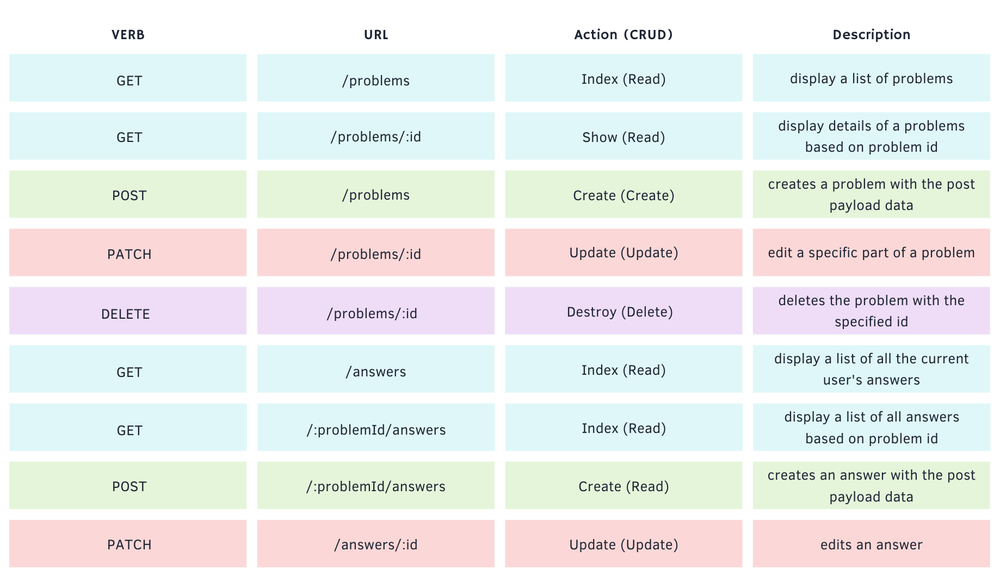
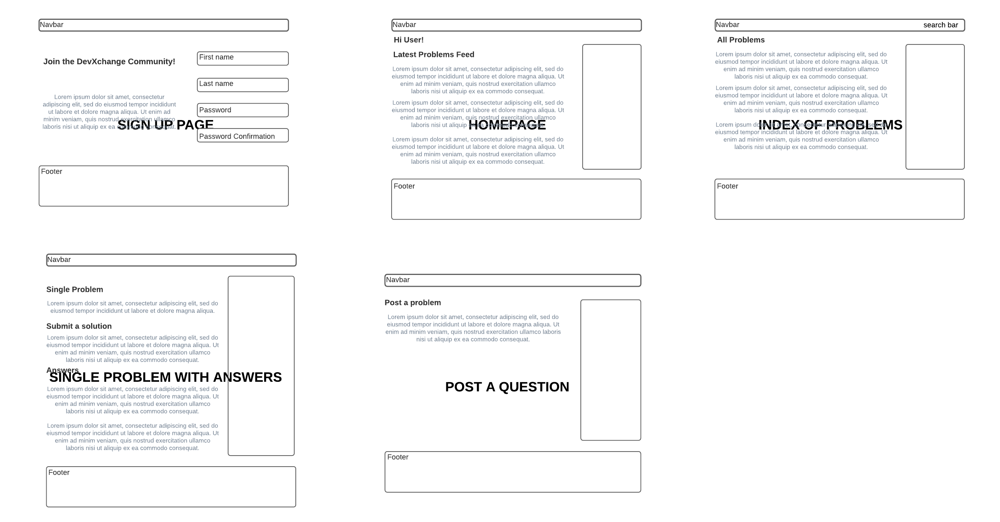

# DevXchange - Client App
Our goal is to create an app that allows developers of all skill ranges to debug, solve, and collaborate on coding problems.

## Deployed App
https://devxchange.herokuapp.com/

## Server Repo
https://github.com/paulinal3/devXchange-api



## Install

Requirements
* MongoDB
* NPM
* <a href="https://github.com/paulinal3/devXchange-api">DevXchange API </a>

Install procedure:

1. In the directory of your DevXChange API, run the following commands
    * ```npm install``` to install necessary npm packages
    * ```npm start``` to instantiate the server, and leave it running
2. Once the API is up and running, move to the directory where you've saved the DevXchange client and run the following commands
    * ```npm install``` to install necessary npm packages
    *  ```npm start``` to launch the DevXchange react app
3. Jump right in and make a user account and start posting questions!

## Tech Stack
* React
* MongoDB
* Mongoose
* CSS/Bootstrap

## Wireframes


## Collections


## MVP
* Create a single page MERN application using ReactJS
* Create a database using MongoDB/Mongoose
* A user is able to post, edit, delete a problem
* A user is able to answer another user’s problem

## Stretch Goals
* Implementing a text editor that could include code snippets and screenshots
    * Using cloudinary as a backup for only screenshots
* Adding a tags collection to use as another way to filter through questions

## Potential Roadblocks
* Implement a rich-text editor
* Use Cloudinary API if needed

# Getting Started with Create React App

This project was bootstrapped with [Create React App](https://github.com/facebook/create-react-app).

## Available Scripts

In the project directory, you can run:

### `npm start`

Runs the app in the development mode.\
Open [http://localhost:3000](http://localhost:3000) to view it in the browser.

The page will reload if you make edits.\
You will also see any lint errors in the console.


## Learn More

You can learn more in the [Create React App documentation](https://facebook.github.io/create-react-app/docs/getting-started).

To learn React, check out the [React documentation](https://reactjs.org/).

### Code Splitting

This section has moved here: [https://facebook.github.io/create-react-app/docs/code-splitting](https://facebook.github.io/create-react-app/docs/code-splitting)

### Analyzing the Bundle Size

This section has moved here: [https://facebook.github.io/create-react-app/docs/analyzing-the-bundle-size](https://facebook.github.io/create-react-app/docs/analyzing-the-bundle-size)

### Making a Progressive Web App

This section has moved here: [https://facebook.github.io/create-react-app/docs/making-a-progressive-web-app](https://facebook.github.io/create-react-app/docs/making-a-progressive-web-app)

### Advanced Configuration

This section has moved here: [https://facebook.github.io/create-react-app/docs/advanced-configuration](https://facebook.github.io/create-react-app/docs/advanced-configuration)
